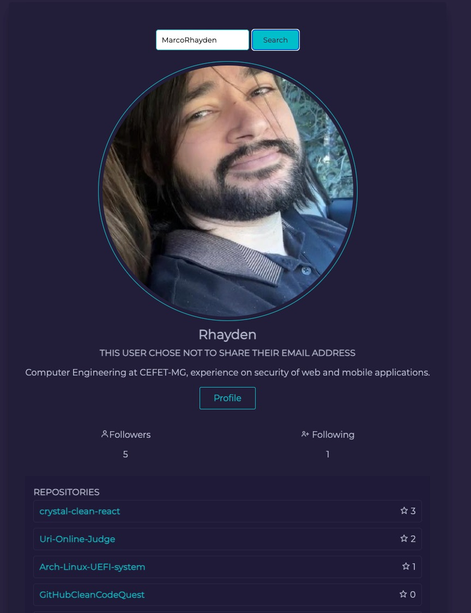

<a name="readme-top" />

<br />
<div align="center">
  <a href="https://github.com/othneildrew/Best-README-Template">
    
  </a>

  <h3 align="center">GitHub Clean Code Quest</h3>

  <p align="center">
    This project is a React application developed following the principles of Clean Architecture, providing a modularized structure for easy maintenance. It is a simple project that consumes GitHub APIs and aims to showcase the implementation of clean architecture, adhering to design patterns and best practices using React.
    <br /><br />
    <a href="https://github.com/mehdihadeli/awesome-software-architecture/blob/main/docs/clean-architecture.md"><strong>Explore a good Clean Architecture Documentation »</strong></a>
    <br />
    <br />
    <a href="https://github-cleancode-quest.netlify.app/">View Demo</a>
    ·
    <a href="https://github.com/MarcoRhayden/GitHubCleanCodeQuest/issues">Report Bug</a>
    ·
    <a href="https://github.com/MarcoRhayden/GitHubCleanCodeQuest/issues">Request Feature</a>
  </p>
</div>

### Prerequisites

Install the latest version of npm

- npm
  ```sh
  npm install npm@latest -g
  ```
- Node

  Make sure you have [Node.js](https://nodejs.org/) installed on your machine. This project was developed using Node.js version 18.

### Installation

1. Clone the repo
   ```sh
   git clone https://github.com/MarcoRhayden/GitHubCleanCodeQuest
   ```
2. Install NPM packages
   ```sh
   npm install
   ```
3. Start the project with
   ```sh
   npm start
   ```
   <div>
   <p align="right">(<a href="#readme-top">back to top</a>)</p>

<h3 align="center">About The Project</h3>

<div align="center">
  <a href="https://github.com/othneildrew/Best-README-Template">
    
  </a>
</div>
  
</br>

<h3 align="center">Clean Architecture and Design Patterns</h3>

<div align="left">
  <p>This project follows the principles of Clean Architecture, providing a modularized structure for easy maintenance and scalability.</p>
  <p>The architecture is divided into distinct layers:</p>
  
  - **Domain Layer**: Contains business logic and entities.
  - **Data Layer**: Handles data storage and retrieval.
  - **Infra Layer**: Manages external concerns like databases and frameworks.
  - **Presentation Layer**: Deals with the user interface and interaction.

- **Application Layer (or EntryPoint Layer)**: This layer serves as the nexus connecting the entire project metaverse. In this specific project, this layer has been designated as the "Main" layer.
  <br/>

</div>

<p align="right">(<a href="#readme-top">back to top</a>)</p>

<h3 align="center">Dependency Injection with Factory Pattern</h3>

  <p>Design Pattern Factory is used for dependency injection and managing component instantiation. It enhances the flexibility and testability of the code.</p>

<div align="left">
  <p>In this project, we utilize the Factory Pattern for dependency injection, promoting loose coupling and making components more testable.</p>
  
  <p>Let's look at a simple example:</p>
</div>

</div>
  
```typescript
// In the domain layer, define an interface for a repository
interface UserRepository {
  getUserById(id: string): User;
  // Other methods...
}
```

```typescript
// In the data layer, implement the repository interface
class UserDataRepository implements UserRepository {
  getUserById(id: string): User {
    // Logic to fetch user from data storage
  }
  // Other implementations...
}
```

```typescript
// In the Main/factories layer, create a factory for the UserDataRepository
export const makeUserDataRepository = (): UserRepository => {
  return new UserDataRepository();
};

// Create a factory for the component in question that will use UserRepository as a dependency.
const MakeUserRepo: React.FC = () => {
  return (
    <UserRepo repo={makeUserDataRepository()} />
  );
};
```

<div>
<h3 align="center">Jest Unit Testing Guide</h3>
</div>

<div align="left">
  <p>This project utilizes Jest, a popular JavaScript testing framework, for performing unit tests. Jest is commonly used for testing React applications and provides a straightforward and powerful way to write and execute tests for your code.</p>

  <h3>Installation</h3>

Before running tests with Jest, ensure it is installed as a development dependency. You can install Jest by running the following command in your project's root directory:

```bash
npm install --save-dev jest
```

Run tests using:

```bash
npm test
```

Generate a code coverage report by running:

```bash
npm test -- --coverage
```
